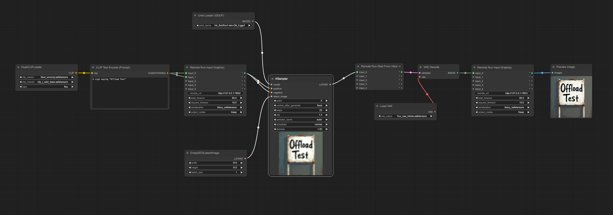
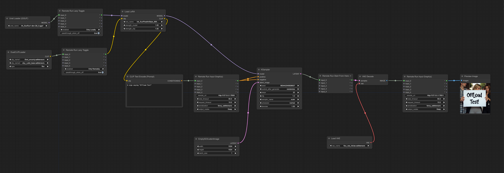

Nodes to run nodes on remote ComfyUI instances.

Included Nodes:

* Remote Run Input Graph: Runs everything going to its inputs on the specified remote instance
* Remote Run Start From Here ->: Used together with above node, makes it only run its input nodes up to hitting a start node
* Remote Run JSON: Runs the JSON on the specified remote instance
* Remote Run Lazy Toggle: Simple toggle switch that runs parts of the graph either only locally or only remotely

Serialization:
* Safetensors: default, uses safetensors, fine for serializing latents and conditionings but may not support more complex types
* Torch Unsafe: normal torch pt, should have widest compatibility, probably best if you have full control or trust of the remote instance.
* Torch Safe: minimal safe implementation of torch pt, safe but only supports a small subset of types

Offloaded text encoder and VAE to remote instances

Same but with lora and toggles to avoid loading unnecessary models:

